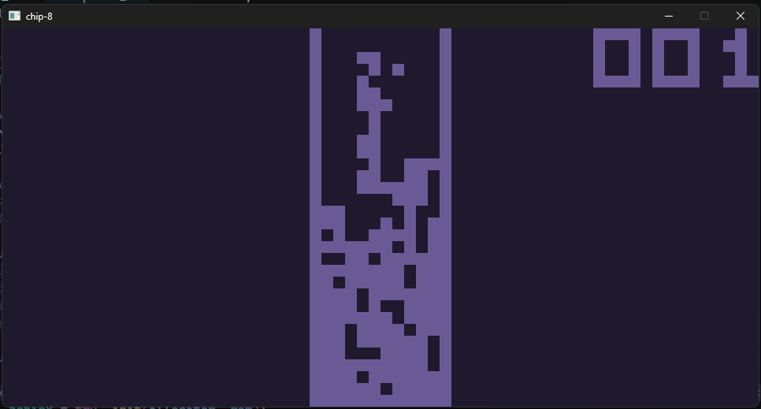
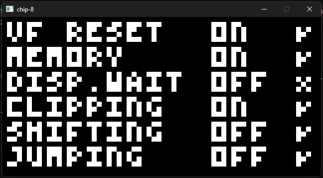
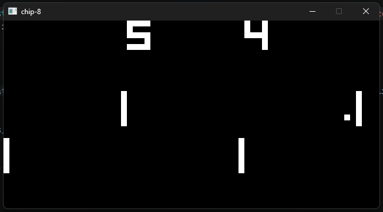

# zchip8
A CHIP-8 emulator (interpreter) written in Zig with SDL3.



`disp.wait` can be configured by changed the step iteration count in the render loop.


# Keyboard Mapping
```
1 2 3 4
Q W E R
A S D F
Z X C V
```



